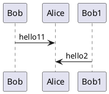

# Title

Intro _em_ and **strong** with `code` and a [link](https://example.com).

> Quote line

- Item 1
- [x] Task item
- [[wiki|node]]

```rs
let x = 1;
```

|  A  |   B |
| :-: | --: |
|  1  |   2 |


Ref[^1]

---

## heading blockquote

> blockquote、blockquote

- Katex: $x = {-b \pm \sqrt{b^2-4ac} \over 2a}$
  - $x = {-b \pm \sqrt{b^2-4ac} \over 2a}$
  - $3 CaO +Fe_2O_3\stackrel{高温}{==}2 Fe + 3 CO_2$
  - $2 CO_2 \stackrel{光}{\underset{\text{催化剂1}}{===}}2 Fe + 3 CO_2$

$$\left( \sum_{k=1}^n a_k b_k \right)^2 \leq \left( \sum_{k=1}^n a_k^{2} \right) \left( \sum_{k=1}^n b_k^2 \right)$$

$$
\begin{array}{c}
\nabla \times \vec{\mathbf{B}} -\, \frac1c\, \frac{\partial\vec{\mathbf{E}}}{\partial t} &
= \frac{4\pi}{c}\vec{\mathbf{j}}    \nabla \cdot \vec{\mathbf{E}} & = 4 \pi \rho \\
\nabla \times \vec{\mathbf{E}}\, +\, \frac1c\, \frac{\partial\vec{\mathbf{B}}}{\partial t} & = \vec{\mathbf{0}} \\
\nabla \cdot \vec{\mathbf{B}} & = 0
\end{array}
$$



[^1]: Footnote text
