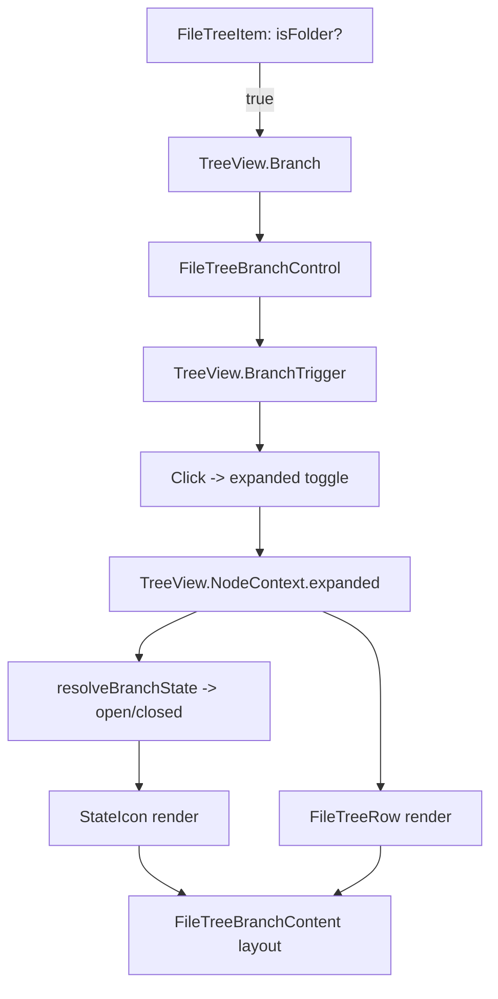

# UX/UI 模块化设计

## 目标

将 UX/UI 设计按单一职责原则拆分为可独立交付与验收的模块，并映射到前端目录结构，保证设计资产、实现代码与验收指标一致。

## 模块总览

- 信息架构
- 任务流与交互
- 视觉与布局
- 组件与模式
- 可用性与无障碍
- 度量与验证
- 国际化（I18n）
- 状态管理（State）

---

## 模块定义

### 1. 信息架构

- 责任边界：导航体系、信息层级、命名规则、内容分组。
- 不负责：视觉表现、动效细节、业务流程逻辑。
- 目录映射：`src/ia/`
- 交付物：站点地图、导航结构、信息分组与命名规范。
- 验收指标：任务查找时间、信息定位成功率、导航路径清晰度。
- 说明：信息架构以常量定义为主，作为导航结构与层级模型的基准配置。
  - `src/ia/nav-model.ts`：导航结构与层级模型常量
  - `src/ia/taxonomy.ts`：内容分组与命名规范常量
  - `src/ia/labels.ts`：界面文案与命名一致性字典
  - 说明：导航项使用 `labelKey`，渲染时通过 `t(labelKey, locale)` 获取对应文案。
  - taxonomy 约定：
    - `contentTypes`：业务内容类型（`note`、`outline`、`markmap`）
    - `editorInputs`：输入方式（`markdown-text`、`wysiwyg`、`markmap`）
    - `viewModes`：视图开关（`markmap-preview`），仅作用于非 `markmap` 输入方式

### 1.1 国际化（I18n）

- 责任边界：文案多语言管理、语言切换策略、命名与键规范。
- 不负责：具体业务流程、视觉样式实现。
- 目录映射：`src/ia/`（文案键与默认语言常量）、`src/i18n/`（翻译资源与加载策略）
- 交付物：文案键表、语言覆盖清单、切换策略与回退规则。
- 验收指标：多语言覆盖率、缺失文案占比、切换一致性。
- 文件说明：
  - `src/i18n/index.ts`：语言切换与回退策略（`t(key, locale)`）
  - `src/i18n/context.tsx`：I18n Provider + locale 上下文封装（内部接入 Ark `LocaleProvider`）
  - `src/i18n/locale.ts`：locale 规范化与方向性（`rtl/ltr`）映射
  - `src/i18n/formatters.ts`：日期/数字/货币格式化（`Intl.*`）
  - `src/i18n/zh-CN.ts`：中文翻译资源
  - 全局方向性接入：在 `src/App.tsx` 根节点设置 `dir={direction()}` 统一 RTL/LTR

### 2. 任务流与交互

- 责任边界：关键任务链路、状态流转、错误与恢复策略、交互反馈规则。
- 不负责：视觉主题与组件样式。
- 目录映射：`src/flows/`
- 交付物：任务流图、状态机/流程编排、错误处理与恢复规则。
- 验收指标：任务完成率、错误率、恢复成功率。

### 3. 视觉与布局

- 责任边界：网格系统、排版层级、色彩与对比策略、视觉节奏与动效原则。
- 不负责：具体业务流程与组件逻辑。
- 目录映射：`src/layouts/`、`src/theme/`
- 交付物：布局规则、排版规范、主题变量（色彩/间距/字体）。
- 验收指标：可读性评分、一致性检查通过率、视觉层级清晰度。
- 结构说明：
  1. 网格与布局区域（主编辑区/侧栏/工具栏）
  2. 排版与层级（标题、正文、注释、代码）
  3. 视觉系统（色彩语义、间距、阴影、边框）

#### 3.1 网格与布局区域（主编辑区/侧栏/工具栏）

- 主编辑区：页面核心区域，优先占据可用宽度，支持多列布局（编辑 + 预览/markmap）。
- 侧栏：用于文件树/标签/最近等导航信息，可折叠，默认保留最小宽度以减少干扰。
- 工具栏：承载全局操作（新建、搜索、同步、设置），位置固定，保持操作可达性。
- 布局原则：
  - 主编辑区优先级最高，侧栏与工具栏不得压缩至影响编辑可读性。
  - 侧栏可收起并记忆状态，减少上下文切换成本。
  - 工具栏与主编辑区的视觉层级明确（对比度或分隔线区分）。
  - markmap 预览优先保持可读与可操作，避免编辑器遮挡关键节点。

##### 侧栏区域（职责、分区、交互）

- 职责与边界：
  - 提供全局导航与上下文切换入口（工作区/文件树/标签/最近等）。
  - 不承载编辑内容，不包含重度表单与复杂编辑交互。
  - 只负责信息入口与轻量筛选，不执行业务流程。
- 分区与内容层级：
  - 顶部：工作区切换/快速入口。
  - 中部：文件树或层级列表（主导航）。
  - 底部：标签、最近、快捷入口等辅助区。
  - 分区之间以分隔线或间距区分层级。
- 交互规则：
  - 支持折叠/展开与宽度拖拽，默认记忆上次状态。
  - 宽度变化不影响主内容可读性（最小宽度约束）。
  - 在窄屏下可退化为抽屉或图标栏，保留关键入口。
  - 列表项支持悬停与选中态强调，避免过度装饰。
- SRP 拆分建议：
  - 骨架层（layouts）：侧栏容器与宽度/折叠状态。
  - 模式层（patterns）：侧栏分区布局（顶部/中部/底部）。
  - 业务层（features）：文件树/标签/最近等具体内容。
- 骨架层设计（SideBar Skeleton）：
  - 组件：`SidebarLayer`（布局占位） + `SidebarShell`（容器边界）。
  - 状态：`collapsed`、`width`、`onToggle`、`onResize` 仅由布局/状态层提供。
  - 约束：骨架层不渲染业务内容，不处理数据流。
- 状态与样式（SRP）：
  - 状态管理：`src/state/useSidebarState.ts`（仅 state，不含 DOM/样式）。
  - 状态接口：`src/layouts/SidebarShell.tsx`（仅 props 契约与 class/style 绑定）。
  - 样式层：`src/layouts/sidebar.css`（宽度/边框/折叠态规则）。
- 约束说明（避免布局联动误伤）：
  - 侧栏骨架不修改 `AppShell` 网格结构，避免影响分割线/悬浮层定位。
  - 侧栏样式迁移到独立样式文件不应改变布局，仅影响容器视觉。
- 模式层设计（SideBar Patterns）：
  - 分区结构：`top` / `body` / `footer` 插槽。
  - `body` 为列表型内容区，可拆分多个 `Section`（文件树/最近打开/标签）。
  - 模式层只定义容器与分区，不包含业务数据或加载逻辑。
- 业务层示例（文件树，SRP 拆分）：
  - 领域层：`src/features/sidebar/file-tree/types.ts`（节点类型定义）。
  - 数据层：`useWorkspaceFileTreeData`（工作区数据获取）。
  - 映射层：`mapWorkspaceTreeToFileNodes`（结构转换为文件树节点）。
  - 状态层：`useFileTreeState`（展开/选中）。
  - 初始化层：`useInitialExpand`（首次展开策略）。
  - 行为层：`useFileTreeActions` + `useTogglePulse`（点击策略与展开/选中动作、动效节奏）。
  - 视图层：`FileTreeView` + `useFileTreeCollection`（TreeView 适配与事件桥接）。
  - 虚拟化层：`FileTreeVirtualList`（虚拟列表渲染）。
  - 行级交互与布局（SRP）：
    - 交互触发：`FileTreeBranchControl`（统一触发入口，内部使用 `BranchTrigger` 确保首次点击稳定）
    - 布局结构：`FileTreeBranchContent`（leading/content/trailing 分区）
    - 状态映射：`resolveBranchState`（open/closed 状态归一）
    - 图标渲染：`StateIcon`（统一状态图标组件，主题感知）
  - 样式层：
    - 基础：`styles/base.css`（结构与布局）
    - 交互：`styles/interaction.css`（hover/selected/focus）
    - 内容：`styles/content.css`（图标/文本/缩进）
    - 主题：`styles/theme-ark.css` / `styles/theme-dense.css` / `styles/theme-classic.css`
  - 主题切换：`style/useFileTreeStyle.ts`（样式选择与切换）
  - 组合层：`FileTreeSection`（组装数据 + 状态 + 视图）
  - 入口透传：`WorkspaceSidebar` 透传 `fileTreeStyle`
  - 测试 UI：`WorkspaceEditorPane` 提供样式切换下拉
  - Public API 约束：外部仅允许通过 `features/sidebar/file-tree/index.ts` 导入，禁止直接引用 `domain/`、`data/`、`state/`、`ui/` 内部模块以保持边界稳定。

- 稳定性迁移建议（文件树目录结构）
  - 目标：在不影响用户行为的前提下，降低改动影响面与回归风险。
  - 迁移顺序（最小风险）：
    1. 纯函数先行：将 `mapWorkspaceTreeToFileNodes` 内的路径解析与树构建拆分为独立纯函数（新建文件，旧函数仅转调）。
    2. 目录落位：新增 `domain/` 目录放置纯函数与 `types.ts`，保持对外 API 不变。
    3. hook 分层：将 `useWorkspaceFileTreeData`、`useWorkspaceFileTree` 移入 `data/`，`useFileTreeState`/`useFileTreeActions`/`useInitialExpand` 移入 `state/`。
    4. UI 组件搬迁：将 `FileTree*` 组件移动到 `ui/`，仅调整 import 路径。
    5. 收尾校验：确认所有导出入口与消费方路径一致，无行为变化。
  - 风险清单（按优先级）：
    - import 路径调整导致构建失败或循环依赖（需逐步迁移并运行类型检查）。
    - 导出重排造成外部引用断裂（可保留旧路径 re-export 过渡）。
    - 迁移过程中误改逻辑（必须保持“纯重构、行为不变”）。
  - 回滚点（每步可撤）：
    - 每一步都只做“单目录 + 单责任”的改动；若出现问题，只回滚当前步文件移动与 import 变更。
    - 关键纯函数拆分后，保留原函数作为薄封装，便于回退。
    - 如需临时稳定，可新增 `index.ts` 做 re-export 保持旧路径可用。

- 折叠触发与布局策略（文件树）：
  - 交互触发：使用 `TreeView.BranchTrigger` 作为唯一触发入口，保证点击图标/文本/空白均可展开，且首次点击稳定。
  - 箭头位置：通过 `FileTreeBranchContent` 将箭头放在行末，并保留固定右侧内边距。
  - 缩进策略：内容区域单独处理 `padding-left`，箭头列不随 depth 移动。
  - 视觉一致性：折叠/展开图标尺寸固定，避免状态切换带来抖动。

- FileTreeBranch 交互流程（Mermaid）：

- IA 与侧栏 Section 对齐（SRP）：
  - IA 层：`navModel` 定义静态入口与层级结构。
  - 模式层：`SidebarSection` 只负责分区与渲染容器。
  - 业务层：`FileTreeSection`/`RecentSection`/`TagsSection` 负责动态内容。
  - 约束：IA 不渲染，Section 不定义 IA，业务层不修改 IA。
- 折叠/展开（SRP）：
  - 行为层：`src/ui/components/useCollapsible.ts` 统一折叠/展开行为与状态语义。
  - 样式层：`src/ui/components/collapsible.css` 统一折叠/展开视觉与过渡。
  - 状态层：`src/state/useSidebarState.ts` 仅维护 `collapsed`。
  - 骨架层：`src/layouts/SidebarShell.tsx` 仅消费 `collapsed` 切换 class。
  - 样式层：`src/layouts/sidebar.css` 仅定义 `.is-collapsed` 的视觉表现。
  - 触发层：页面/业务组件仅调用 `toggle`/`setCollapsed`，不参与布局计算。

##### 响应式断点与布局变形规则

- 响应式断点（以骨架变形为准）：
  - 断点逻辑以“最小可用宽度”驱动，不以固定像素硬切。
  - 规则优先级：预览优先退化为浮层 → 侧栏退化为抽屉/图标栏 → 编辑区进入单列模式。
  - 规则表达：
    - 当 `W >= sideMin + editorMin + previewMin`：三列（侧栏 + 编辑 + 预览/markmap）。
    - 当 `W < sideMin + editorMin + previewMin`：预览改为悬浮/抽屉，不占布局列。
    - 当 `W < sideMin + editorMin`：侧栏折叠（抽屉或仅保留图标栏）。
    - 当 `W < editorMin`：进入单列编辑，工具栏仅保留核心动作。
  - 默认建议区间（可根据 min 值推导后调整）：
    - `W >= 1440px`：三列完整布局。
    - `1200px <= W < 1440px`：侧栏 + 编辑为主，预览切换为浮层。
    - `900px <= W < 1200px`：侧栏折叠为图标栏/抽屉。
    - `768px <= W < 900px`：工具栏精简为图标 + 更多菜单。
    - `W < 768px`：单列内容，预览仅以浮层/抽屉出现。
  - 代码模块建议（SRP）：
  - 规则层（纯函数/配置）：`src/layouts/rules/layoutBreakpoints.ts`
  - 状态层（监听尺寸 → variant）：`src/state/useResponsiveLayout.ts`
  - 视图层（消费 variant 组合骨架）：`src/layouts/MainLayout.tsx` / `src/ui/patterns/MultiPaneShell.tsx`
  - 主编辑区内容响应（SRP）：
    - 规则层：`src/layouts/rules/contentBreakpoints.ts`
    - 状态层：`src/state/useResponsiveContent.ts`
    - 视图层：`src/ui/patterns/workspace/WorkspaceEditorPane.tsx`
  - 主编辑区内容排版规则：
    - 使用 `max-width + margin: 0 auto` 实现内容居中（极窄屏时自然占满）。

##### 3.1.1 组件划分（SolidJS）

- 布局容器（骨架层）：
  - `AppShell`：布局根容器，组织三层结构与全局区域。
  - `SidebarLayer`：侧栏层，承载 `Sidebar` 区域。
  - `ContentStage`：主内容层，作为内容插槽容器（不固定内部列数）。
  - `FloatingPanelLayer`：浮层宿主，承载悬浮编辑面板插槽。
  - `ToolbarRegion`：工具栏区域（可在 `AppShell` 内部或单独区域容器）。
- 多列结构容器：
  - `MultiPaneLayout`：多列结构容器，按传入列配置渲染，不含交互逻辑。
- 区域容器：
  - `Sidebar`：文件树/标签/最近等导航区。
  - `Toolbar`：全局操作区（新建、搜索、同步、设置）。
  - `EditorPane`：主编辑区容器。
  - `MarkmapStage`：markmap 主视图容器。
  - `PreviewPane`：文档预览容器（按布局状态启用）。
- 分割线交互（通用组件）：
  - `Sash`：分割线交互元件（渲染与拖拽入口）。
  - `SashContainer`（patterns）：集中渲染多条分割线（按列计算位置）。
- 组合层（patterns）：
  - `MultiPaneShell`：组合多列结构 + 分割线交互 + 尺寸策略（不含业务逻辑）。
- 拖拽抖动控制（实现要点）：
  - `MultiPaneLayout` 使用稳定子节点渲染（如 `Index`），避免拖拽时重建 pane 导致闪烁。
  - 列宽由 `grid-template-columns` 驱动，保证拖拽逻辑生效。
  - 拖拽期间为 pane 启用 `contain: layout paint` 与 `will-change: width`，限制重排范围。
  - `Sash` 拖拽开始/结束设置 `html[data-resizing]`，作为样式提示。
- 渲染稳定性规范（MUST）：
  - 频繁更新且顺序稳定的列表/容器必须使用基础设施组件（如 `StableList`），禁止直接 `map` 生成子节点。
  - 禁止在业务组件内直接使用 `Index`，仅允许在基础设施组件内部使用。
  - 动态增删的列表使用 `For` 并提供稳定 key，避免节点重建与动画抖动。
- 渲染稳定性排查清单（当前项目）：
  - MUST（高频更新 + 顺序稳定）：`src/ui/patterns/SashContainer.tsx` 的分割线渲染需迁移到 `Index`。
  - SHOULD（更新频率中等或视图抖动风险较高）：`src/features/sidebar/file-tree/FileTreeView.tsx`、`src/ui/components/TreeView.tsx`。
  - OK（低频/静态）：`src/ui/components/Select.tsx`、`src/App.tsx`（routes）、`src/ui/patterns/workspace/WorkspaceSidebar.tsx`（导航模型映射）。
- 通用工具栏（patterns）：
  - `ToolbarShell`：通用工具栏骨架（left/center/right slots）。
- 通用工具栏（components）：
  - `Toolbar`：通用工具栏容器（布局与对齐）。
  - `ToolbarGroup`：工具栏分组容器（成组动作/控件）。
  - `ToolbarSpacer`：弹性空白，用于左右区块分离。
- 说明：骨架层仅保留 `ToolbarRegion`，`Regions.Toolbar` 不使用。
- Tauri Overlay 标题栏：
  - 使用 `titleBarStyle: "Overlay"` 时，工具栏骨架容器需加 `data-tauri-drag-region`，用于窗口拖拽。
  - 预留左右安全区（如系统按钮区）时，使用 CSS 变量控制内边距（按平台调整）。
  - macOS 右侧安全区建议值：`--titlebar-inset-right: 10px`。
- 层级关系（全链路示例）：
  - `AppShell` → `SidebarLayer` → `Sidebar`
  - `AppShell` → `ToolbarRegion` → `Toolbar`
  - `AppShell` → `ContentStage` → `MultiPaneShell` → `MultiPaneLayout` → `EditorPane` / `PreviewPane` / `MarkmapStage`
  - `AppShell` → `ContentStage` → `SashContainer` → `Sash`
  - `AppShell` → `FloatingPanelLayer` → `FloatingEditorPanel`

##### 3.1.2 布局状态补充：编辑 + markmap 悬浮预览

- 形态说明：markmap 作为主视图全屏展示，编辑面板以“悬浮编辑层”形式出现。
- 交互规则：
  - 编辑面板为固定悬浮层（非节点 hover 触发），可拖拽或贴边停靠。
  - 编辑面板采用避让规则，不遮挡节点文本本体，必要时自动偏移。
  - 支持最小化/收起与固定（pin）状态，减少遮挡与频繁切换。
- 尺寸与层级：
  - 悬浮编辑层占比不超过视口宽度 35%，默认半透明或带阴影区分。
  - markmap 节点优先层级最高，编辑层不得覆盖节点文本本体。

#### 3.2 排版与层级（标题、正文、注释、代码）

- 层级职责：
  - 标题：结构导航与分段，引导阅读路径。
  - 正文：主要阅读内容，优先可读性与行宽控制。
  - 注释：补充信息，视觉权重降低但仍可读。
  - 代码：等宽与背景区分，避免与正文混淆。
- 规则原则：
  - 正文优先：标题不抢戏，注释弱化，代码仅在必要时突出。
  - 行宽建议：60-80 字符范围内保持稳定阅读节奏。
  - 行高建议：正文 1.5-1.7，标题略紧，注释略松。
- SRP 代码层级结构：
  - 规则层（tokens）：字号/行高/字重/颜色等基础变量。
  - 映射层（variants）：标题/正文/注释/代码与 tokens 的对应关系。
  - 视图层（Typography）：仅按 variant 选择 class，不参与计算。
  - 使用层（页面/业务）：仅选择 variant，不定义样式规则。
- 推荐目录结构：
  - `src/ui/typography/tokens.ts`
  - `src/ui/typography/variants.ts`
  - `src/ui/components/Typography.tsx`
  - `src/ui/typography/typography.css`

#### 3.3 视觉系统（色彩语义、间距、阴影、边框）

- SRP 层级划分：
  - 规则层（tokens）：色彩语义/间距/阴影/圆角的基础定义。
  - 视图层（CSS 变量）：仅暴露变量，不含业务样式。
  - 使用层（组件/页面）：仅消费变量，不写硬编码色值。
- 目录结构：
  - `src/ui/theme/tokens.ts`
  - `src/ui/theme/theme.css`
- 命名建议：
  - 色彩：`--color-text-*`、`--color-bg-*`、`--color-border-*`、`--color-accent-*`
  - 间距：`--space-*`
  - 阴影：`--shadow-*`
  - 圆角：`--radius-*`

### 4. 组件与模式

- 责任边界：可复用 UI 组件、组合式交互模式、组件约束与使用指南。
- 不负责：业务流程编排。
- 目录映射：`src/ui/components/`、`src/ui/patterns/`
- 交付物：组件清单、组件 API、模式库与使用示例。
- 验收指标：组件复用率、改动影响面、组件一致性合规率。
- 组件层级（建议）：
  - 基础组件：Button、Input、Select、Label、Tabs、Tooltip、IconButton
  - 复合组件：TreeView（文件树）、SearchBar（搜索栏）、Breadcrumb（路径）、TagList（标签）
  - 编辑组件：EditorToolbar、MarkdownEditor、MarkmapCanvas
- 模式清单（建议）：
  - 空状态模式：无文件/无内容时引导与建议动作
  - 搜索筛选模式：左侧搜索 + 结果列表
  - 双栏编辑模式：编辑 + 预览
  - 悬浮编辑模式：markmap 预览 + 浮层编辑面板
  - 批量操作模式：多选文件/标签的批量删除、移动
- 描述模板：
  - 组件：职责 / 使用场景 / API / 交付物 / 验收指标
  - 模式：目标 / 触发条件 / 交互规则 / 交付物 / 验收指标
- 责任边界（补充）：
  - `patterns` 只负责结构与插槽，不包含业务状态与逻辑。
  - `features` 承载业务内容与交互逻辑，可调用 `src/a11y/` 工具。
  - 通用状态（如布局模式）放在 `src/state/`，不归于 `layouts` 或 `ia`。

#### 4.1 Ark UI 引入的 SRP 分层建议

- 目标：将交互状态机、视觉样式、业务语义解耦，确保每层只有一个变化理由。
- 分层边界：
  - 行为层（Ark）：只负责可访问性与状态机交互，不引入业务语义与样式。
  - 组件层（项目 API）：只暴露项目语义 props（如 `size`/`variant`），内部组合行为层并绑定样式 class。
  - 样式层（CSS）：只定义视觉规则，依赖 `data-*` 状态钩子与主题变量。
  - 业务层（features）：只使用项目组件，不直接依赖 Ark。
- 推荐目录结构：
  - `src/ui/ark/`：Ark primitives 组合层（行为层）
  - `src/ui/components/`：项目对外组件 API
  - `src/ui/styles/`：组件视觉样式
  - `src/ui/theme/`：主题 tokens 与 CSS 变量
- 变更理由映射（SRP）：
  - Ark API 变化 → 仅修改 `src/ui/ark/`
  - 视觉主题变化 → 仅修改 `src/ui/styles/` 或 `src/ui/theme/`
  - 业务语义变化 → 仅修改 `src/ui/components/` 或 `src/features/`
- Select 的层级样例：
  - 行为层：`src/ui/ark/select/Select.tsx`（组合 Ark Select primitives）
  - 组件层：`src/ui/components/Select.tsx`（封装 props + class）
  - 样式层：`src/ui/styles/select.css`（基于 `data-state`/`data-disabled`）

#### 4.2 Ark 组件迁移清单与优先级（建议）

- 原则：先迁移交互复杂度高、可访问性风险高、复用频率高的组件。
- P0（立即收益）：
  - TreeView（当前自研递归渲染，交互与可访问性风险高）
  - Dialog/Popover/Tooltip（焦点管理与可访问性边界复杂）
  - Menu/Select/Combobox（键盘交互复杂，状态组合多）
- P1（中期收益）：
  - Tabs/Accordion/Splitter（结构性强，适合统一状态）
  - Switch/Checkbox/RadioGroup（表单一致性）
  - Slider/NumberInput/Editable（输入与状态一致性）
- P2（可选增强）：
  - Pagination/Carousel/Rating/ColorPicker/DatePicker（依赖业务价值再评估）
  - QRCode/Marquee 等展示组件（需求驱动）
- 项目映射建议（先对齐现有目录）：
  - `src/ui/components/TreeView.tsx` → Ark Tree View（P0）
  - `src/ui/components/Select.tsx` → Ark Select（P0）
  - `src/ui/components/Toolbar.tsx` → 保留自研（P2，结构稳定）
  - `src/ui/components/TextInput.tsx` → 保留自研（P1 之后再评估）
  - `src/ui/components/Button.tsx` → 保留自研（P2，样式优先）
  - `src/ui/components/useCollapsible.ts` → 可对接 Ark Collapsible（P1）

#### 4.3 TreeView 组件分层草图（SRP）

- 目标：将树形交互（展开/选中/焦点/键盘）与业务语义、视觉样式分离。
- 行为层（Ark）：`src/ui/ark/tree-view/TreeView.tsx`
  - 只组合 Ark Tree View primitives，暴露稳定的 slots 与状态钩子。
  - 不引入业务语义（如文件/标签）、不包含样式。
  - 输入最小化：`items`、`selectedIds`、`expandedIds`、`on*` 事件。
- 组件层（项目 API）：`src/ui/components/TreeView.tsx`
  - 对外暴露项目语义 props（如 `variant`/`density`/`onNodeAction`）。
  - 内部组合行为层，映射业务结构到 Ark item 结构。
  - 仅绑定 class 与 slot props，不直接写样式规则。
- 样式层（CSS）：`src/ui/styles/tree-view.css`
  - 只定义视觉表现，依赖 `data-state`/`data-selected`/`data-focused`。
  - 颜色与间距只来自 `src/ui/theme/theme.css` 变量。
- 业务层（features）：`src/features/sidebar/file-tree/*`
  - 只依赖 `src/ui/components/TreeView.tsx`，不直接触碰 Ark。

示意结构（非代码）：
```
src/ui/ark/tree-view/TreeView.tsx
  - <TreeView.Root>
      <TreeView.Tree>
        <TreeView.Item>
          <TreeView.ItemText />
          <TreeView.BranchIndicator />
        </TreeView.Item>
      </TreeView.Tree>
    </TreeView.Root>

src/ui/components/TreeView.tsx
  - props: nodes, selectedId(s), onSelect, variant, density
  - map nodes -> ark items
  - class: "ui-tree-view" + variant/density modifiers

src/ui/styles/tree-view.css
  - .ui-tree-view [data-selected]
  - .ui-tree-view [data-focused]
  - .ui-tree-view [data-branch]
```

### 5. 可用性与无障碍

- 责任边界：可访问性策略（ARIA）、键盘可达性、可理解性与容错。
- 不负责：信息架构或流程逻辑。
- 目录映射：`src/a11y/`
- 交付物：无障碍规范、辅助功能清单、键盘操作规则。
- 验收指标：WCAG 达标率、键盘覆盖率、无障碍缺陷数量。
- 能力模块（建议）：
  - `focus/`：焦点管理（自动聚焦、回退、焦点陷阱）
  - `keyboard/`：键盘导航（快捷键、方向键支持）
  - `aria/`：ARIA 规范 helpers（role/属性生成器）
  - `contrast/`：对比度计算/检查
  - `announcer/`：屏幕阅读器提示（aria-live）
- 实现边界说明：
  - `src/a11y/` 仅提供规则与工具函数，不直接承载业务逻辑。
  - `src/a11y/` 的触发点位于模式层/业务层（`patterns`/`features`），例如弹窗、浮层等状态变化场景。
  - 基础组件只提供可访问性属性与可聚焦能力，不做全局焦点决策。

### 6. 度量与验证

- 责任边界：各模块的指标定义、验收方法、数据采集与复盘节奏。
- 不负责：具体 UI 产出与实现。
- 目录映射：`docs/metrics/`（文档层面）
- 交付物：指标定义表、验收清单、可用性测试方案。
- 验收指标：指标覆盖率、验收流程完成率。

---

## 前端目录规划建议

- `src/ia/`：信息架构模块
- `src/flows/`：任务流与交互模块
- `src/layouts/`：布局系统
- `src/theme/`：主题与视觉变量
- `src/ui/components/`：可复用组件
- `src/ui/patterns/`：交互模式
- `src/a11y/`：无障碍策略与工具

---

## Workspace 文件树前端拆分（SRP）

### 模块拆分

- API 适配层：`src/features/workspace/api/workspaceApi.ts`
  - `getCurrentWorkspace()` / `getWorkspaceFileTree(workspaceId)`
- 状态层：`src/state/workspace/useWorkspaceTree.ts`
  - `currentWorkspace` / `tree` / `loading` / `error`
- 行为层：`src/features/workspace/hooks/useWorkspaceTreeActions.ts`
  - `loadCurrentWorkspace()` / `refreshTree()`
- 视图层：`src/ui/patterns/workspace/WorkspaceSidebar.tsx`
  - 只负责渲染树，不负责数据请求

### 交互与职责边界

- `WorkspaceSidebar` 消费状态，不执行 `invoke`。
- API 层只做命令调用与 DTO 映射，不包含业务逻辑。
- 状态层负责缓存与刷新策略，避免 UI 组件重复请求。

---

## 评审与协作规则

- 每个模块独立评审，避免跨模块耦合影响验收。
- 设计变更需标注影响模块与指标。
- 代码实现应严格遵守模块目录边界。

---

## 版本记录

- v0.1 初始化模块划分与目录映射
